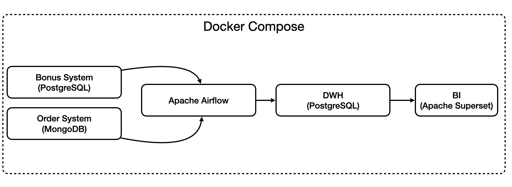
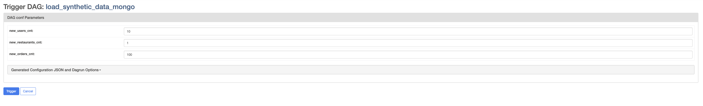
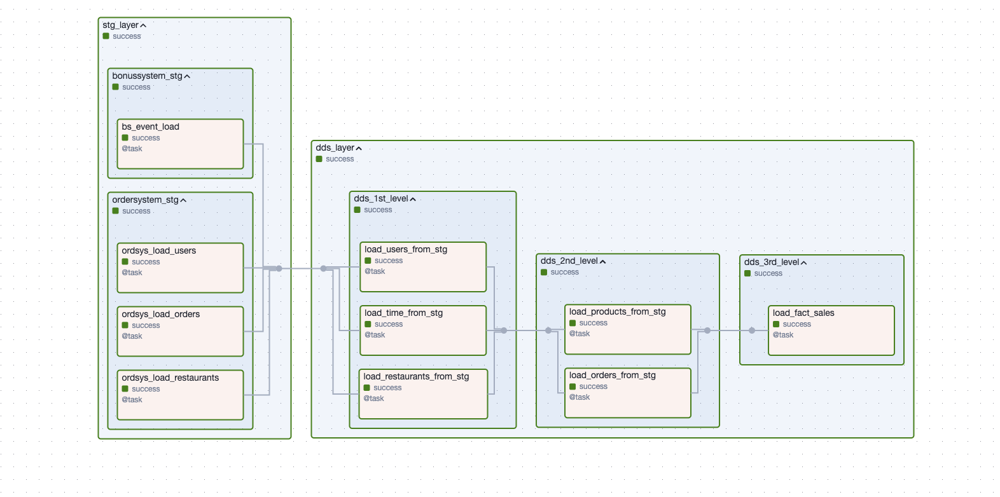
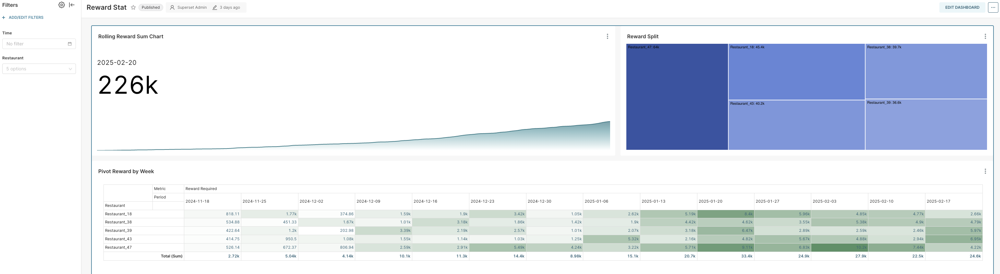

### Project 1: Inmon Model Data Warehouse with BI & Orchestration

## Overview

This project implements a classical Inmon-style Data Warehouse with three layers: Staging (STG), Data Distribution (DDS), and Corporate Data Mart (CDM). The warehouse is built using PostgreSQL, with Apache Airflow orchestrating the ETL processes, and Apache Superset providing visualization and BI capabilities.

Additionally, MongoDB is used as a NoSQL data source, demonstrating the integration of structured and semi-structured data.

## Stack:

- PostgreSQL – Data Warehouse for structured data storage + seperate instance as data source

- MongoDB – NoSQL database as a data source

- Apache Airflow – ETL pipeline orchestration

- Apache Superset – Business Intelligence and visualization

- Docker & Docker Compose – Containerized deployment

- Python – ETL scripts and data processing


## Architecture

Data Flow:

- Source Data: Extracted from various sources (MongoDB and Postgres).

- STG: Raw data is loaded into PostgreSQL without transformations.

- DDS: Data is cleaned, deduplicated, and processed into relational tables.

- CDM: Aggregated and structured data, optimized for analytics.

- BI Layer: Apache Superset visualizes business KPIs and reports.



## Setup & Launch

### Prerequisites

Ensure you have the following installed:

- Docker & Docker Compose

- Python 3.9+ (for local testing, optional)

- Apache Airflow CLI (optional for debugging DAGs)

#### Step 1: Clone the Repository

```bash
git clone https://github.com/AndreyPolyan/de_pet_projects.git
cd <path_to_git_repos>/de_pet_projects/de-project-1
```

#### Step 2: Configure Environment Variables

Create a .env file in the project root and set the required environment variables. Use .env_template as a reference

#### Step 3: Start the Services

Run the entire setup using Docker Compose. First launch requires building, use --build option

```bash 
docker compose up -d --build
```

#### Step 4. Open Airflow UI

Go to web browser and enter
```bash
http://localhost:6002

Username: airflow
Password: airflow
```
#### Step 5. Launch DAGs

By default DAGs are disabled. You need to enable them manually in following order

- load_synthetic_data_mongo

    DAG will generate synthetic data for the project. Trigger it manually and enter desired number of orders/users/restaurants
    
- dwh_migrations_init

    DAG will create all required schemas/tables in DWH. DAG will also handle migrations if you change the SQL and they won't ruin DWH.
    
    All migration files are stored in `<path_to_git_repos>/de_pet_projects/de-project-1/airflow/dags/dwh/_migrations_` folder. DAG runs every 10 minutes and check file content with cached values. If change appears, DAG will try to push it.
- dwh_load_stg_dds_entities
    
    DAG will push data from source to STG layer and transform it in DDS layer. Note: by default it pushes 1000 units per entity, so if more synthetic data is created, you will either need to manually trigger DAG several times or to wait till it process it (runs every 15 minutes).
    
    
-  cdm_load_daily_reports

    DAG will calculate datamarts in CDM layer. By default calculates today()-1 date. But if triggered manually, you can enter the start and end dates.
    
    To ensure all data is processed, try
    
    start_date -> today() - 180 (as date, ex. 2024-06-01)
    
    end_date -> today() (as date, ex. 2025-01-01)

#### Step 6. Check the BI
In web browser
```bash
http://localhost:28088

Username: admin
Password: admin
```

Select **Reward Stat** dashboard



#### Step 7. Feel free to adjust for your needs


---
###License

This project is licensed under the MIT License – you are free to modify and distribute it as needed.