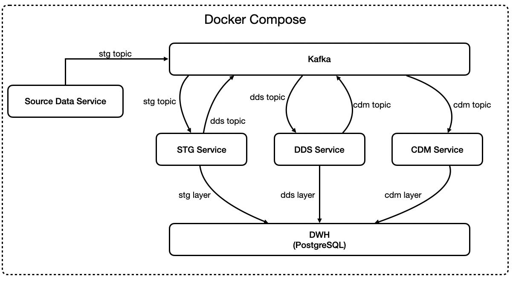
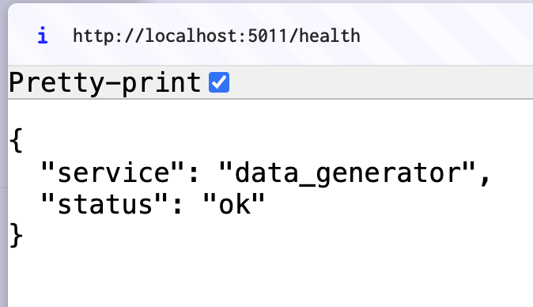
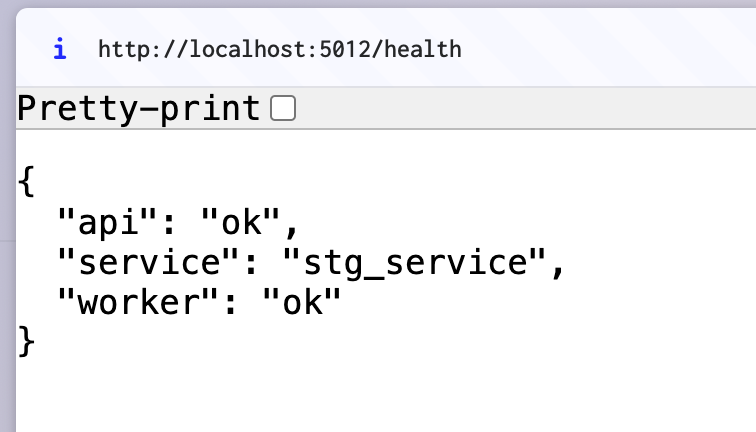
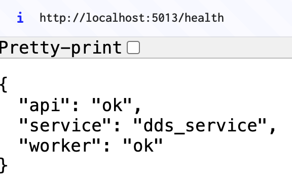
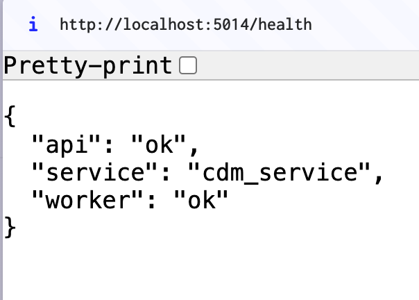
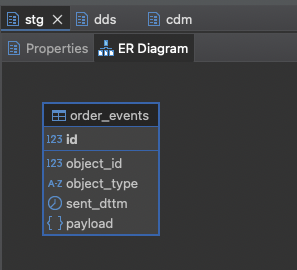
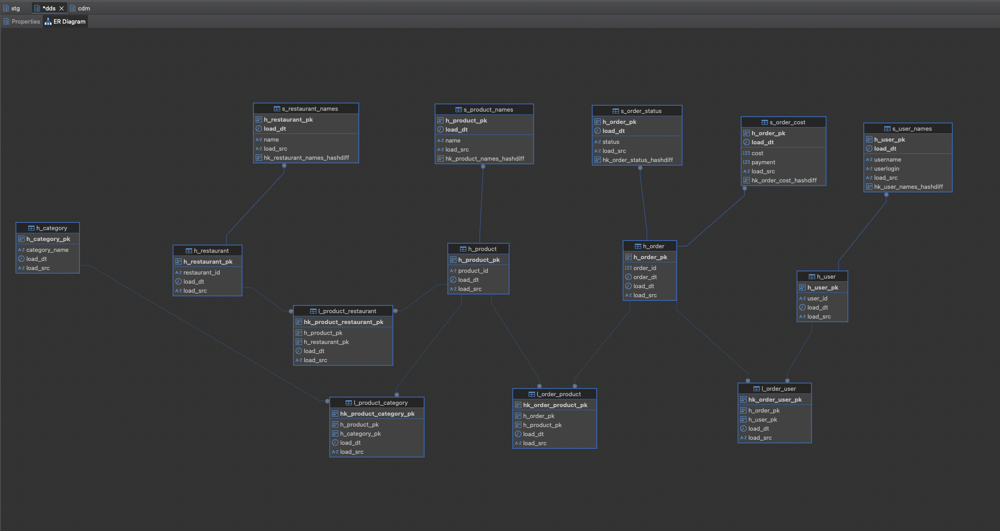
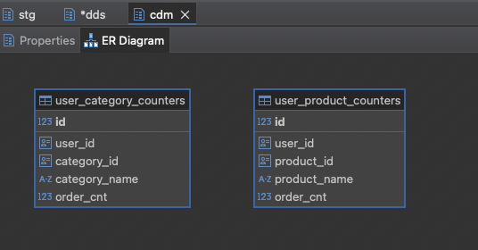
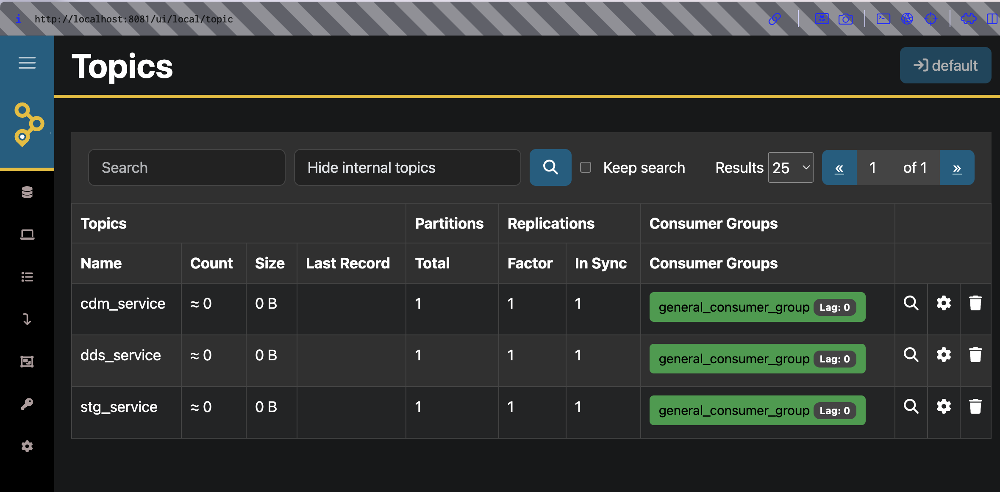
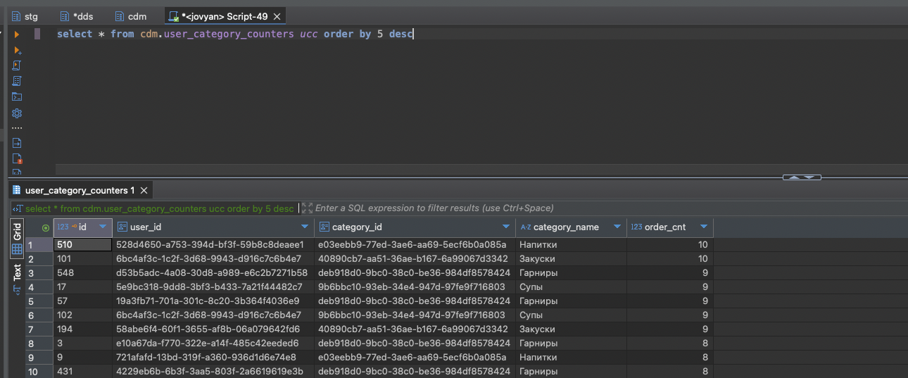

### Project 2. Streaming data processing using microservices

## Overview

This project covers streaming data processing using Python (Flask) based microservices. Data between services is pushed via Kafka.

Idea: create a near realtime updated storage of users/product/categories counters that is further on used for user recommendations.

##### Note: uuid is used as entitites key for quicker implementation of the project. Production solution better to be created with integet keys to improve join perfomance

## Stack:

- PostgreSQL – Data Warehouse for structured data storage. Includes stg/dds layers to keep data in structured way and cdm layer with outcome datamarts. Postgres is selected for easy-to-go with OLTP (since we read/write data by row on continious basis). Data Vault model is used for DDS.

- Redis - warehouse of User/Restaurant information. Used to enlarge messages data on flight

- Apache Kafka – Messages Broker

- AKHQ - UI for Kafka

- Docker & Docker Compose – Containerized deployment

- Python – data processing microservices


## Architecture

Data Flow:

- Source Data: source data is generated in Data Source Service by POST request and pushed to stg_service topic in Kafka

- STG Service: reads data from Kafka, enlarge data from Redis (user/restaurant info), pushes updated messages inro into in Kafka and ito STG layer in DWH

- DDS Service: reads data from Kafka, transform it into DDS Data Vault, pushes updated messages into cdm_topic in Kafka and ito DDS layer in DWH

- CDM Service: reads daat from Kafka, updates CDM layer (counter datamarts)




## Default connections 
| **Resource**  | **Location**  | **Credentials**  |
|-------------|----------------|------------------|
| **DWH DB (Postgres)** | localhost:6432 |User / Password / DB : de / engineer / dwh|
| **Redis** | localhost:6379 ||
| **AKHQ (as Kafka UI)** | localhost:8081 ||
| **Data Source Service** | localhost:5011 |endpoints: /health to check health (GET), /push to generate synthetic messages (POST)|
| **STG Service** | localhost:5012 |endpoints: /health to check health (GET)|
| **DDS service** | localhost:5013 |endpoints: /health to check health (GET)|
| **CDM service** | localhost:5014 |endpoints: /health to check health (GET)|


## Contracts (messages structure)

**stg_topic**:

```json
{
  "object_id": 7608298,
  "object_type": "order",
  "sent_dttm": "2025-02-22T09:43:14.049943+00:00",
  "payload": {
    "restaurant": {
      "id": "af69ef12f4f34c6d86441c69"
    },
    "date": "2025-02-22T08:56:14.049848+00:00",
    "user": {
      "id": "d3275d9d9530440ea2b0be23"
    },
    "order_items": [
      {
        "name": "какой-то суп",
        "price": 641,
        "category": "Супы",
        "id": "97a91f3df3b44224bb8d67a4",
        "quantity": 5
      },
      {
        "name": "еще суп",
        "price": 169,
        "category": "Супы",
        "id": "22a38d8dbb584051b8b72f15",
        "quantity": 5
      }
    ],
    "bonus_payment": 0,
    "cost": 4050,
    "payment": 4050,
    "bonus_grant": 0,
    "statuses": [
      {
        "status": "OPEN",
        "dttm": "2025-02-22T09:01:14.049848+00:00"
      },
      {
        "status": "COOKING",
        "dttm": "2025-02-22T09:16:14.049848+00:00"
      },
      {
        "status": "DELIVERING",
        "dttm": "2025-02-22T09:36:14.049848+00:00"
      },
      {
        "status": "CLOSED",
        "dttm": "2025-02-22T09:56:14.049848+00:00"
      }
    ],
    "final_status": "CLOSED",
    "update_ts": "2025-02-22T09:56:14.049848+00:00"
  }
}

```

**dds_topic**:

```json
{
  "object_id": 7608298,
  "object_type": "order",
  "payload": {
    "id": 7608298,
    "date": "2025-02-22T08:56:14.049848+00:00",
    "cost": 4050,
    "payment": 4050,
    "status": "CLOSED",
    "restaurant": {
      "id": "af69ef12f4f34c6d86441c69",
      "name": "ООО «Нестерова, Дементьева и Алексеев»"
    },
    "user": {
      "id": "d3275d9d9530440ea2b0be23",
      "name": "Зоя Олеговна Костина",
      "login": "belovlongin"
    },
    "products": [
      {
        "id": "97a91f3df3b44224bb8d67a4",
        "price": 641,
        "quantity": 5,
        "name": "какой-то суп",
        "category": "Супы"
      },
      {
        "id": "22a38d8dbb584051b8b72f15",
        "price": 169,
        "quantity": 5,
        "name": "еще суп",
        "category": "Супы"
      }
    ]
  }
}

```

**cdm_topic**:

```json
[
  {
    "object_id": "01c5e4c5-4c22-42dc-87d4-7559f344b124",
    "object_type": "cdm_order_event",
    "payload": {
      "order_id": "2a86e8a3-faae-37c2-9cb6-70af837dd42f",
      "user_id": "25f98706-7d86-3388-bfba-ea8376a8bbe1",
      "product_id": "b5ed2502-4f0d-3dc6-9a39-22cd6038acbf",
      "product_name": "какой-то суп",
      "category_id": "9b6bbc10-93eb-34e4-947d-97fe9f716803",
      "category_name": "Супы"
    }
  },
  {
    "object_id": "03effdb0-87c5-4877-a1e0-a412c6fe904c",
    "object_type": "cdm_order_event",
    "payload": {
      "order_id": "2a86e8a3-faae-37c2-9cb6-70af837dd42f",
      "user_id": "25f98706-7d86-3388-bfba-ea8376a8bbe1",
      "product_id": "5fef8f39-d458-3793-a1ee-a3333506ecc4",
      "product_name": "еще суп",
      "category_id": "9b6bbc10-93eb-34e4-947d-97fe9f716803",
      "category_name": "Супы"
    }
  }
]
```


## Setup & Launch

### Prerequisites

Ensure you have the following installed:

- Docker & Docker Compose

- Python 3.9+ (for local testing, optional)


#### Step 1: Clone the Repository

```bash
git clone https://github.com/AndreyPolyan/de_pet_projects.git
cd <path_to_git_repos>/de_pet_projects/de-project-2
```

#### Step 2: Configure Environment Variables

Create a .env file in the project root and set the required environment variables. Use .env_template as a reference

#### Step 3: Start the Services

Run the entire setup using Docker Compose. First launch requires building, use --build option

```bash 
docker compose up -d --build
```

#### Step 4. Check services health

Go to web browser and enter
```bash
-- Checking Data Generator
http://localhost:5011/health
```


```bash
-- Checking STG Service
http://localhost:5012/health
```


```bash
-- Checking DDS Generator
http://localhost:5013/health
```


```bash
-- Checking CDM Generator
http://localhost:5014/health
```


#### Step 5. Check DWH structure

Connect DWH (Postgres) using appropriate IDE

```bash
user: de
password: engineer
host: localhost
post: 6432
```

Check all schemas and tables are available








#### Step 6. Check Kafka UI

Check if all topics are available. In web browser go to

```bash
-- 
http://localhost:8081
```



#### Step 7. Create synthetic data

```bash
curl -X POST http://localhost:5011/push \
     -H "Content-Type: application/json" \                                           
     -d '{"N": 10000}' 
```

```bash
{"messages_pushed":10000,"status":"success"}
```

#### Step 8. Wait for data to be processed

Each service processes 200 messages per 30 seconds (can be adjusted inside service's code files)


#### Step 9. Check the data is in DWH




#### Step 10. Feel free to adjust for your needs

#### Step 11 (optional). To close the project

```bash
cd <path_to_git_repos>/de_pet_projects/de-project-2


-- If we want to keep the data persistent for further restart
docker compose down

-- If we want to fully close the project and remove all data
docker compose down -v
```


---
### License

This project is licensed under the MIT License – you are free to modify and distribute it as needed.