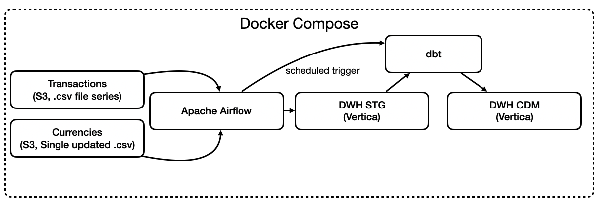
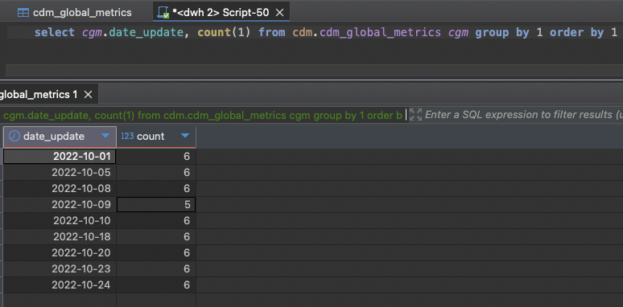

### Project 3. Kimball DWH in Vertica with dbt transformations

### Stack: Docker, Python, Vertica, dbt, Airflow

## Overview

This project implements a classical Kimball-style Data Warehouse with two layers: Staging (STG) and Corporate Data Mart (CDM). The warehouse is built using Vetica, with Apache Airflow orchestrating the EL process of ingesting data into raw layer, and dbt performing transformation over raw data.

As a data source S3 storage is used (MiniO).

Idea: build DWH from scratch, use S3 as a common data source for data and dbt as easy-to-go solution for transformation stage.

Source data: buisness finance app transactions (by batch .csv) and currencies rate (single long tail .csv file, that is updated).

Output: report with all transactions flow.

## Stack:

- Vertica – Data Warehouse for structured data storage. Standalone, one local cluster only (since CE edition).

- Apache Airflow – EL pipeline orchestration and dbt run triggering.

- MiniO S3 – S3 data storage.

- Docker & Docker Compose – Containerized deployment

- dbt – T-scripts for data processing

- Python – ETL scripts and data processing


## Architecture

Data Flow:

- Source Data: source data is shown as a S3 storage

- STG: Raw data is loaded into Vertica without transformations. Error load is held via Vertica's COPY-REJECTION functionality

- CDM: Aggregated and structured data, optimized for analytics. Transformations are done through dbt models.

- TBD: dbt test checks to provide data quality



## Default connections 
| **Resource**  | **Location**  | **Credentials**  |
|-------------|----------------|------------------|
| **Airflow UI** | localhost:6002 |User / Password: airflow / airflow|
| **Airflow Metadata DB (Postgres)** | localhost:15432 |User / Password / DB : airflow / airflow / airflow|
| **DWH DB (Vertica)** | localhost:25433 |User / Password / DB : de / engineer / dwh|
| **MiniO UI (S3)** | localhost:29000 |User / Password : data / engineer|


## Setup & Launch

### Prerequisites

Ensure you have the following installed:

- Docker & Docker Compose

- Python 3.9+ (for local testing, optional)

- Apache Airflow CLI (optional for debugging DAGs)

#### Step 1: Clone the Repository

```bash
git clone https://github.com/AndreyPolyan/de_pet_projects.git
cd <path_to_git_repos>/de_pet_projects/de-project-3
```

#### Step 2: Configure Environment Variables

Create a .env file in the project root and set the required environment variables. Use .env_template as a reference

#### Step 3: Start the Services

Run the entire setup using Docker Compose. First launch requires building, use --build option

```bash 
docker compose up -d --build
```

With first setup Vertica takes a while to load (about 1-2 minutes). Better to wait (can be checked in Docker Dashboard, if CPU usage is ~5-10%, we are ready to go).

#### Step 4. Open Airflow UI

Go to web browser and enter
```bash
http://localhost:6002

Username: airflow
Password: airflow
```
#### Step 5. Launch DAGs

By default DAGs are disabled. You need to enable them manually in following order

- dwh_migrations_init

    DAG will create STG/CDM schemas and create tables in STG for raw data load. DAG will also handle migrations if you change the SQL and they won't ruin DWH.
    
    All migration files are stored in `<path_to_git_repos>/de_pet_projects/de-project-2/airflow/dags/dwh/_migrations_` folder. DAG runs every 10 minutes and check file content with cached values. If change appears, DAG will try to push it.
- dwh_load_stg_data
    
    DAG will push data from source to STG layer. The way DAG is organised: it captures max last_modified data from first load and then check by files metadata if updates took place. If yes, it download all files with updated last_update_date. Thus we ensure to capture all changes in S3 storage.
    
-  dwh_dbt_job

    DAG will trigger dbt to perform transformations.

    Models are located in container in ```/opt/dbt/de_project_3```, locally in `<path_to_git_repos>/de_pet_projects/de-project-3/dbt/de_project_3`.

    By default Airflow triggers dbt with launch_date = today() - 1. It is inside dbt models as `'{{ var("launch_date") }}'`.
    
    To upload historic data (data example range is 2022-10-01 -- 2022-11-01), you need to trigger backfill from airflow cli:
    ```bash
    -- Find any airflow container running. For example, airflow scheduler
    docker ps -a

    --
    CONTAINER ID   IMAGE                            COMMAND                  CREATED          STATUS                      PORTS                                              NAMES                                           de-project-3-airflow-worker-1
    <container_name>   de-project-3-airflow-scheduler   "/usr/bin/dumb-init …"   10 minutes ago   Up 10 minutes (healthy)     8080/tcp                                           de-project-3-airflow-scheduler-1
    ```
    ```bash
    -- Enter the container
    docker exec -it <container_name> bash
    ```
    ```bash
    -- Run backfilling
    airflow dags backfill -s 2022-10-01 -e 2022-11-01 dwh_dbt_job
    ```

    Airflow will create task instances for all required dates and trigger dbt with appropriate parametr.

    Once done, exit the container

    ```bash
    exit
    ```

#### Step 6. Check CDM mart
Connect DWH (Vertica) using appropriate IDE

```bash
user: de
password: engineer
host: localhost
db: dwh
port: 25433
```



#### Step 7. Feel free to adjust for your needs

#### Step 8 (optional). To close the project

```bash
cd <path_to_git_repos>/de_pet_projects/de-project-2


-- If we want to keep the data persistent for further restart
docker compose down

-- If we want to fully close the project and remove all data
docker compose down -v
```


---
### License

This project is licensed under the MIT License – you are free to modify and distribute it as needed.

